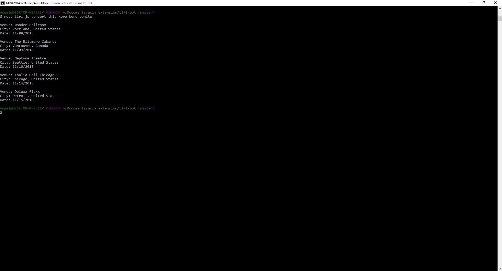
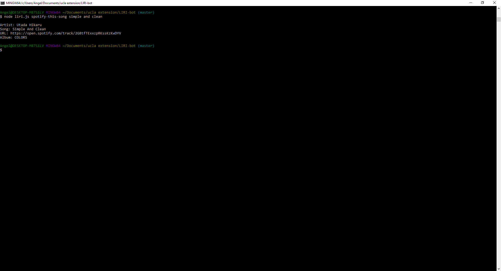
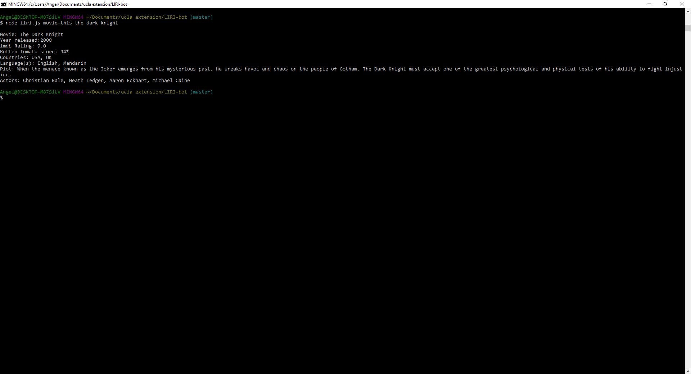
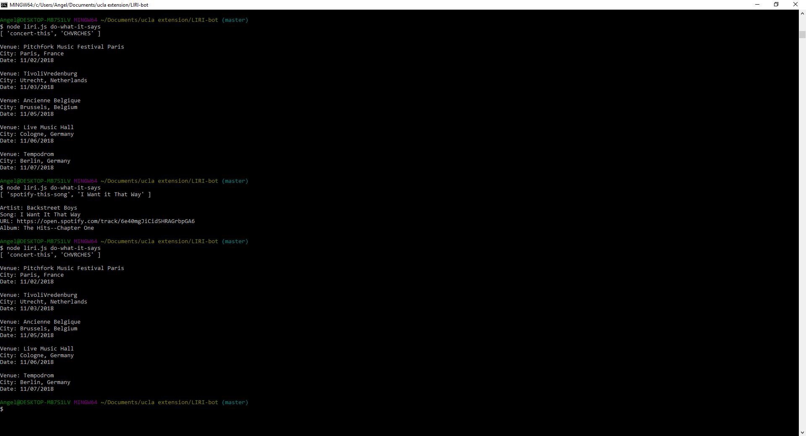
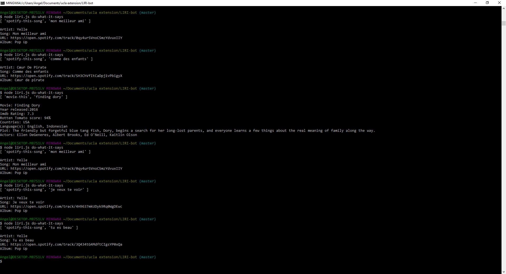

# LIRI-bot
## How to use
The application follows the following format:
$node /directory/liri.js [command] [parameters]

The available commands are:
1. concert-this
2. spotify-this-song
3. movie-this
4. do-what-it-says

## Previews
concert-this:

Displays up to 5 upcoming concerts for the specified artist

spotify-this-song:

Displays the artist, song name, spotify URL, and album of the given song name

movie-this:

Displays the title, year, imdb rating, rotten tomatoes rating, country, languages, plot, and actors of the given movie

do-what-it-says:

Performs a random command with a random parameter from a list of options

## How it works
concert-this:

Uses the request package and the Bands in Town API

spotify-this-song:

Uses the request package and the Spotify API 

movie-this:

Uses the request package and the omdb API

do-what-it-says:

Uses the fs package to read the random.txt file. Splices based off of ";" for a pair of commands and arguments. Reads the command and performs the function with the paired parameter.